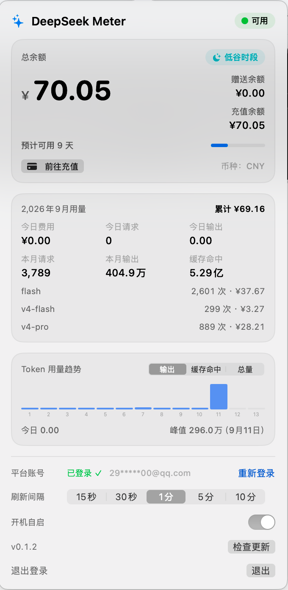
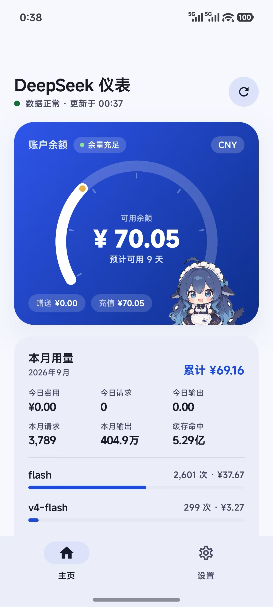

# DeepSeekMeter 

[中文](README.md)

DeepSeekMeter is a lightweight, privacy-first account monitor for **macOS, Windows and Android**, with an **iOS source build** in the same repository. It shows your DeepSeek balance, spending, request/token usage and daily trends without sending data to a third party.

## Features

### Shared account features

- Balance and wallet currency display
- Official DeepSeek sign-in embedded in the app, with automatic session-token capture and manual-paste fallback where supported
- Monthly and today cost, request count, output tokens, cache-hit tokens and per-model breakdown
- Daily token trend for the current month (output / cache-hit / total)
- Configurable refresh intervals from 15 seconds to 10 minutes on desktop and foreground mobile screens
- Local-only account data flow; no analytics SDK, proxy or third-party upload

### Platform capabilities

- **macOS**: menu bar balance, popover UI and launch-at-login
- **Windows**: system-tray balance colors, WebView2 login and current-user launch-at-login
- **Android**: lifecycle-aware foreground polling, WorkManager best-effort background refresh and low-balance local notifications
- **iOS**: SwiftUI app, Keychain token storage, foreground/background refresh, low-balance local notification and snapshot-driven WidgetKit balance widget

## Screenshots

| macOS — popover | Android — device |
| :---: | :---: |
|  |  |

## Requirements

| Platform | For users | For source builds |
| :--- | :--- | :--- |
| macOS | macOS 14 or later, Apple Silicon or Intel | Xcode Command Line Tools; full Xcode is not required for the macOS target |
| Windows | Windows 10 version 1809 or later / Windows 11; the release ZIP is self-contained | .NET 8 SDK; WebView2 Runtime is usually available, but install it separately or use the manual token fallback if initialization fails |
| Android | Android 8.0 / API 26 or later; release APK is direct-install and debug-signed | JDK 17 and Android SDK platform 35; the repository Gradle wrapper downloads Gradle 8.14.2 |
| iOS | No public binary yet | Xcode 16 or later, iOS 17 deployment target; Apple Developer signing is needed for device distribution |

## Build from source

Run these commands from the repository root:

~~~bash
# macOS
swift build
swift build -c release
bash Scripts/run-tests.sh
bash Scripts/build-app.sh release

# Windows (PowerShell)
dotnet build windows/DeepSeekMeter.sln -c Release
dotnet run --project windows/src/DeepSeekMeter -c Release
pwsh Scripts/publish-windows.ps1

# Android
cd android
./gradlew :core:test :app:assembleDebug
./gradlew :app:assembleRelease
cd ..

# iOS core and project checks (Xcode is optional for the core checks)
bash Scripts/run-ios-tests.sh
# Full simulator build/install/run; requires Xcode and an iOS runtime
bash Scripts/run-ios-simulator.sh
~~~

Platform-specific guides: [Windows](windows/README.md), [iOS](ios/README.md) and [Android](android/README.md).

## Quick start

After launching a desktop or mobile build:

1. Open the app and choose **Log in**.
2. Sign in on the official platform.deepseek.com page with your password or QR code.
3. Return to the app; the balance and current usage snapshot are loaded automatically.
4. If the session expires, choose **Log in again**. Sign out clears the locally stored token.

## Privacy and data

- Requests go directly from the app to DeepSeek private platform endpoints: /auth-api/v0/users/current, /api/v0/users/get_user_summary, /api/v0/usage/by_api_key/amount and /api/v0/usage/by_api_key/cost. These endpoints are not a public API contract and platform aggregation may have its own reporting delay.
- In-app updates make **read-only** requests to GitHub (`api.github.com/repos/harmonarch/DSM/releases/latest`, Release asset downloads and SHA256SUMS verification) purely to check for and fetch new versions. No local data is uploaded; automatic checks can be disabled in settings.
- The app does not send tokens, balances, usage data, telemetry or analytics to this repository owner or any other third party.
- Token storage is platform-specific: macOS UserDefaults at ~/Library/Preferences/com.deepseek.meter.plist, Windows DPAPI-protected settings, iOS Keychain, and Android Keystore-encrypted ciphertext in SharedPreferences.
- The iOS widget reads only a non-sensitive balance snapshot from the App Group container. Android background work never receives the token as WorkManager input data.
- Never paste a real token into source code, issue reports, logs or screenshots.

## Repository map

~~~text
Sources/DeepSeekMeter/       macOS SwiftUI + AppKit menu bar app
windows/                     .NET 8 + WPF system-tray implementation
  README.md                  Windows English guide
  README.zh-CN.md            Windows Chinese guide
ios/                         iOS SwiftUI app, WidgetKit extension and shared core
android/                     Android Compose app and zero-AndroidX core module
Scripts/                     build, packaging, self-test and mobile validation scripts
MOBILE-PLAN.md               mobile milestones, decisions and boundary rules
.github/workflows/            CI for macOS/Windows/iOS/Android; tag-based release pipeline
~~~

## Tests and CI

~~~bash
# macOS
bash Scripts/run-tests.sh

# Windows
dotnet run --project windows/tests/DeepSeekMeter.Selftest -c Release

# iOS core, drift and project checks
bash Scripts/run-ios-tests.sh

# Android JVM tests and debug app build
cd android && ./gradlew :core:test :app:assembleDebug
~~~

Every pull request and main push runs the platform CI jobs. Pushing a v* tag runs the release workflow, which builds the macOS DMG, Windows self-contained ZIP and Android APK, then attaches them to a GitHub Release. iOS simulator artifacts are validated in CI but are not published as a user download.

## FAQ

- **The token expired.** Choose **Log in again**. The app re-authenticates through the official page.
- **The desktop icon is missing.** Check that the process is running, then run the platform install instructions again. macOS apps are menu-bar-only and do not show a Dock icon.
- **Android notifications do not appear.** Enable notifications for the app in Android system settings; background delivery is best-effort and subject to WorkManager/OS scheduling.
- **How do I uninstall?** Remove the app and its local data: macOS ~/Library/Preferences/com.deepseek.meter.plist, Windows %APPDATA%/DeepSeekMeter and %LOCALAPPDATA%/DeepSeekMeter, or uninstall/clear Android app storage. iOS data is removed with the app.
- **Where is iOS TestFlight?** The source implementation is ready, but signing and distribution still require an Apple Developer Program account.

## Contributing

Contributions are welcome. Read [CONTRIBUTING.md](CONTRIBUTING.md) first; the Chinese version is [CONTRIBUTING.zh-CN.md](CONTRIBUTING.zh-CN.md). It covers build/test commands, commit conventions and project boundaries. AI coding agents should also follow [AGENTS.md](AGENTS.md).

## License

[MIT](LICENSE) © 2026 pppolf
