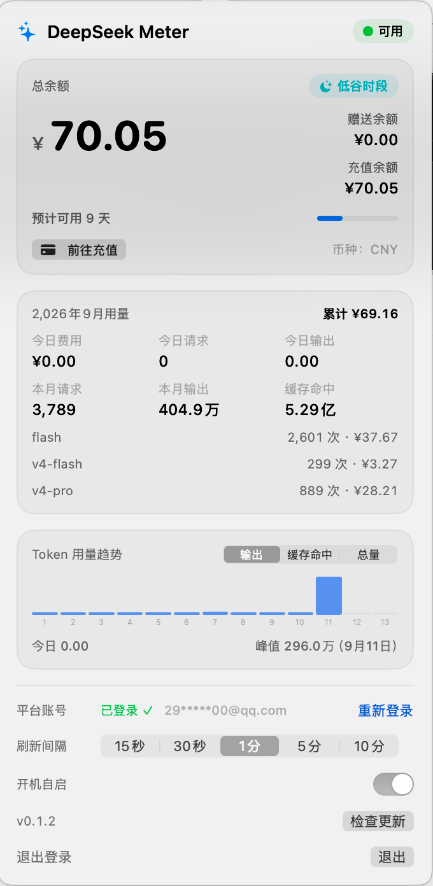
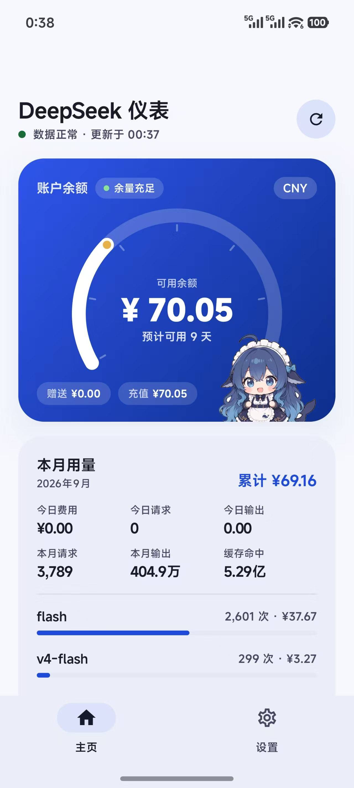

# DeepSeekMeter 

[English](README.en.md)

DeepSeekMeter 是一个轻量、注重隐私的账户监视工具，覆盖 **macOS、Windows、Android**，并在同一仓库提供 **iOS 源码实现**（功能已完成，公开分发仍需 Apple 开发者账号）。它展示 DeepSeek 余额、消费、请求/Token 用量和按天趋势，不把数据发送给任何第三方。

## 功能

### 共通能力

- 展示余额和钱包币种
- 内嵌 DeepSeek 官方登录页，自动提取登录态 Token；支持的平台提供手动粘贴兜底
- 本月/今日费用、请求数、输出 Token、缓存命中 Token 和按模型拆分
- 本月按天 Token 趋势（输出 / 缓存命中 / 总量）
- 桌面端和移动端前台页面支持 15 秒至 10 分钟的刷新间隔
- 数据只在本机与 DeepSeek 官方接口之间流转，无统计 SDK、代理或第三方上报

### 平台能力

四个平台共用同一个版本号与同一套平台接口契约；**版本号相同不代表能力相同**，各端可用的能力以下表为准（部分支持、规划中或条件可用的能力已在单元格内注明）：

| 能力 | macOS | Windows | Android | iOS |
| :--- | :---: | :---: | :---: | :---: |
| 余额 / 本月费用 / 请求数 / Token 用量 | ✅ | ✅ | ✅ | ✅ |
| 按天 Token 趋势（输出 / 缓存命中 / 总量） | ✅ | ✅ | ✅ | ✅ |
| 续航读数（余额 ÷ 近 7 日均费用，满格 30 天） | ✅ | ✅ | ✅ | ✅ |
| 缓存命中率（百分比） | ✅ 本月/今日百分比 | —（仅缓存命中 Token 绝对值） | —（仅绝对值） | —（仅绝对值） |
| 按 API Key 拆分本月用量 | ✅ | — | — | — |
| DeepSeek 服务健康度（官方状态页） | ✅ | — | — | — |
| 余额低阈值本地通知 | ✅ | — | ✅ | ✅ |
| 常驻入口 | 菜单栏 | 系统托盘 | —（A5 小组件规划中） | WidgetKit 小组件（需付费账号的 App Group；免费账号显示 0） |
| 应用内更新 | ✅ | ✅ | ✅ | —（暂无公开分发） |
| 开机自启 | ✅ | ✅ | 不适用 | 不适用 |
| Token 存储 | UserDefaults（ad-hoc 签名刻意为之） | DPAPI | Keystore 加密后存 SharedPreferences | Keychain |

各端实现形态：macOS 悬浮窗展示明细；Windows 托盘图标随余额变色；移动端前台轮询，后台刷新尽力而为（Android 为 WorkManager，iOS 为 BGAppRefreshTask）。Token 存储与登录方式等细节见各端专项说明。

## 截图

| macOS — 悬浮窗 | Android — 真机 |
| :---: | :---: |
|  |  |

## 环境要求

| 平台 | 普通用户 | 源码构建 |
| :--- | :--- | :--- |
| macOS | macOS 14+，Apple Silicon 或 Intel | Xcode Command Line Tools；macOS target 不要求完整 Xcode |
| Windows | Windows 10 1809+ / Windows 11；Release ZIP 自包含 | .NET 8 SDK；内嵌登录页通常可使用 WebView2 Runtime，若初始化失败可安装 Runtime 或使用手动 Token 兜底 |
| Android | Android 8.0 / API 26+；Release APK 可直装 | JDK 17、Android SDK platform 35；仓库 wrapper 会自动下载 Gradle 8.14.2 |
| iOS | 暂无公开二进制包 | Xcode 16+、iOS 17 部署目标；真机分发需要 Apple Developer 签名 |

## 从源码构建

以下命令均在仓库根目录执行：

~~~bash
# macOS
swift build
swift build -c release
bash Scripts/run-tests.sh
bash Scripts/build-app.sh release

# Windows（PowerShell）
dotnet build windows/DeepSeekMeter.sln -c Release
dotnet run --project windows/src/DeepSeekMeter -c Release
pwsh Scripts/publish-windows.ps1

# Android
cd android
./gradlew :core:test :app:assembleDebug
./gradlew :app:assembleRelease
cd ..

# iOS 核心与工程校验（核心校验不要求 Xcode）
bash Scripts/run-ios-tests.sh
# 模拟器构建/安装/运行，需要 Xcode 和 iOS 运行时
bash Scripts/run-ios-simulator.sh
~~~

平台专项说明：[Windows](windows/README.zh-CN.md)、[iOS](ios/README.zh-CN.md)、[Android](android/README.zh-CN.md)。

## 快速开始

启动桌面或移动端版本后：

1. 打开 App，选择「登录」。
2. 在官方 platform.deepseek.com 页面使用密码或扫码登录。
3. 回到 App，余额和当前用量快照会自动加载。
4. 如果登录态过期，选择「重新登录」；退出登录会清除本机保存的 Token。

## 隐私与数据

- 请求由 App 直接发往 DeepSeek 私有平台接口：/auth-api/v0/users/current、/api/v0/users/get_user_summary、/api/v0/usage/by_api_key/amount、/api/v0/usage/by_api_key/cost。这些不是公开 API 契约，平台聚合本身可能存在统计延迟。
- 应用内更新会向 GitHub 发出**只读**请求（`api.github.com/repos/harmonarch/DSM/releases/latest` 与 Release 资源下载、SHA256SUMS 校验），仅用于检查和获取新版本，不上传任何本地数据；可在设置中关闭自动检查。
- 服务健康度读取 DeepSeek 官方状态页（status.deepseek.com）：只读、无鉴权，同样不上报任何本地数据。该页没有公开 JSON API，App 读的是页面自身的公开数据源；两条都拿不到时显示「状态未知」而不是「运行正常」。
- App 不会把 Token、余额、用量、遥测或分析数据发送给本项目维护者或任何其他第三方。
- Token 按平台存储：macOS UserDefaults（路径为 ~/Library/Preferences/com.deepseek.meter.plist）、Windows DPAPI 保护的设置、iOS Keychain、Android Keystore 加密后写入 SharedPreferences 的密文。
- iOS 小组件只从 App Group 读取非敏感余额快照；Android 后台任务不会通过 WorkManager 输入数据接收 Token。
- 不要把真实 Token 粘贴到源码、Issue、日志或截图中。

## 仓库结构

~~~text
Sources/DeepSeekMeter/       macOS SwiftUI + AppKit 菜单栏 App
windows/                     .NET 8 + WPF 系统托盘实现
  README.md                  Windows 英文说明
  README.zh-CN.md            Windows 中文说明
ios/                         iOS SwiftUI App、WidgetKit 扩展与共享核心
android/                     Android Compose App 与零 AndroidX 核心模块
Scripts/                     构建、打包、自测与移动端校验脚本
MOBILE-PLAN.md               移动端里程碑、决策与边界规则
.github/workflows/            macOS/Windows/iOS/Android CI 与标签发布流水线
~~~

## 测试与 CI

~~~bash
# macOS
bash Scripts/run-tests.sh

# Windows
dotnet run --project windows/tests/DeepSeekMeter.Selftest -c Release

# iOS 核心、漂移与工程校验
bash Scripts/run-ios-tests.sh

# Android JVM 单测与 debug App 构建
cd android && ./gradlew :core:test :app:assembleDebug
~~~

每个 Pull Request 和 main push 都会运行平台 CI。推送 v* 标签会启动发布流水线，构建 macOS DMG、Windows 自包含 ZIP 和 Android APK，并附加到 GitHub Release。iOS 模拟器产物会在 CI 中校验，但暂不作为用户下载包发布。

## 常见问题

- **Token 过期了。** 点「重新登录」，App 会通过官方页面重新认证。
- **桌面图标不见了。** 检查进程是否运行，再按对应平台的安装说明重装；macOS 是纯菜单栏 App，不会显示 Dock 图标。
- **Android 没有通知。** 在系统设置中允许 App 通知；后台投递受 WorkManager 和系统调度影响，属于尽力而为。
- **如何卸载？** 删除 App 及本机数据：macOS 的 ~/Library/Preferences/com.deepseek.meter.plist、Windows 的 %APPDATA%/DeepSeekMeter 与 %LOCALAPPDATA%/DeepSeekMeter，或清除/卸载 Android App 数据；iOS 删除 App 即可。
- **iOS 为什么没有 TestFlight？** 源码实现已就绪，但签名与分发仍需要 Apple Developer Program 账号。

## 贡献

欢迎贡献。请先阅读 [CONTRIBUTING.md](CONTRIBUTING.md)，中文版见 [CONTRIBUTING.zh-CN.md](CONTRIBUTING.zh-CN.md)，其中包含构建/测试命令、提交规范和项目边界。AI 编码助手还应遵循 [AGENTS.md](AGENTS.md)。

## 开源协议

[MIT](LICENSE) © 2026 pppolf
